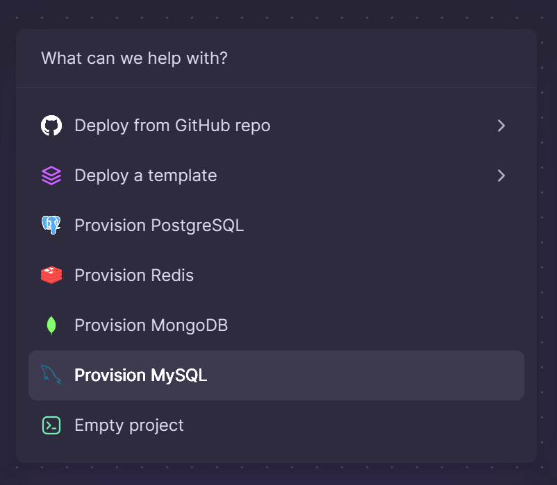
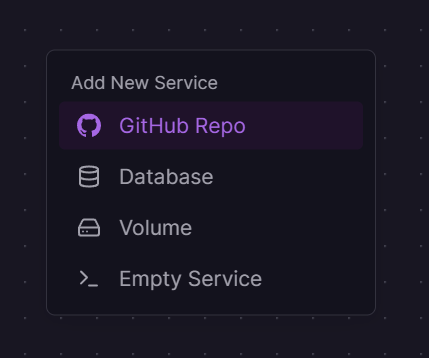
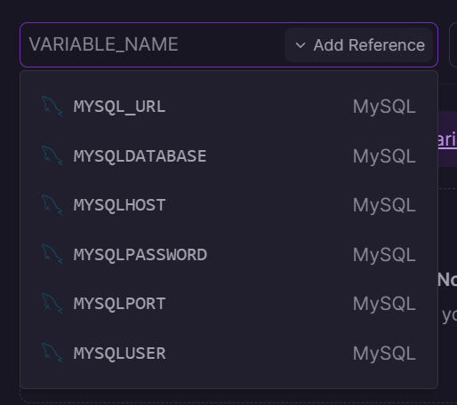

# Deploy on Railway

## What is Railway?

Railway is a Platform as a Service that allows a simple experience to deploy an application from GitHub with a variety of languages or a Dockerized application using [Nixpacks](https://nixpacks.com/docs/deploying/railway). 

## Deployment

### Requirements
* A Railway account ([Sign up here](https://railway.app?referralCode=IxhRN8))
* A fork of this PHP API GitHub

### Step 1. MySQL Database

From the **Railway Dashboard**, click **New Project** and select **MySQL Database**. This will provision a new database without any tables. 

Create a new table named `aliases`. Add the two columns: `slug` and `url`. Both columns should be `NOT NULL` and of type `text`. 

Click **Add Row**. This is the data that will forward your URLs. For the purposes of this demonstration, add the following:

|slug|url|
|-|-|
|home|https://google.com|
|twitter|https://twitter.com|
|linkedin|https://linkedin.com|

Once there is data populated, return to the **Dashboard**.

### Step 2. PHP Application

Right-click on the **Dashboard** and click **GitHub Repo** from **Add New Service**. You will see a list of repositories that Railway has access to. If the list is empty, click **Configure GitHub App** and select the repositories Railway should have access to. Railway will build and deploy the code in the repository. 

To connect the MySQL service to the PHP Application, click **New Variable**. Next to `VARIABLE_NAME` will be a drop down labeled **Add Reference** with a list of the environment variables from the MySQL service. 

Once the environment variables are set, click **Generate Domain** under **Settings**.

### See it live!

To see your application at work, try the link `<your-service-name>.up.railway.app/?goto=home`. This will take you to the URL set in the database.